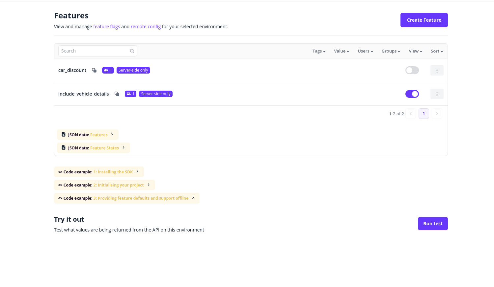
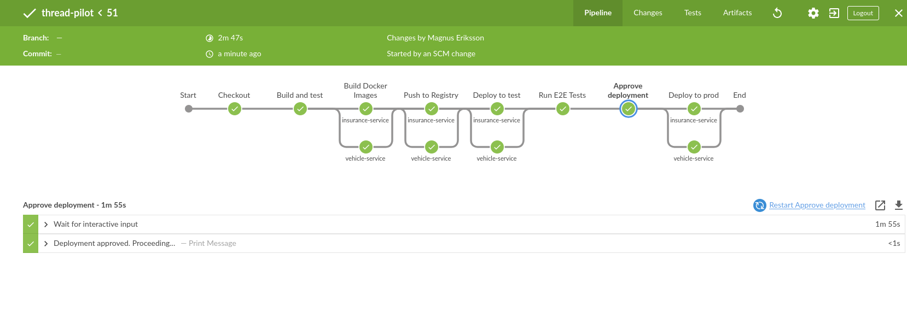
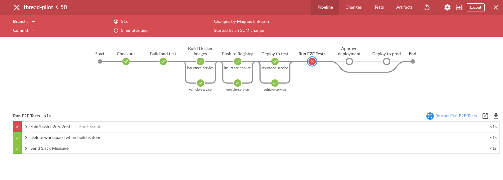

# ThreadPilot

## Architecture
The project is implemented as a multi-module Gradle project with two main modules written in 
Java 21 using Spring Boot 3.5 as the main framework:
  - **Vehicle Service**
    - ***/v1/vehicle/{registrationNumber}*** returns vehicle info in the format:
```json
  {
    "id": 1,
    "registrationNumber": "XYZ123",
    "make": "Toyota",
    "model": "Corolla",
    "year": 2020
  }
```
  - **Insurance Service**:
    - ***/v1/insurances/{personId}*** returns a person's insurances. Applies feature flags to determine 
      whether to include vehicle details and discounts in the response and fetches vehicle info from
      vehicle Service. The response is a list of insurances for a person in the format:
```json
[
  {
    "id": 1,
    "type": "PET",
    "monthlyCost": 10
  },
  {
    "id": 2,
    "type": "HEALTH",
    "monthlyCost": 20
  },
  {
    "id": 3,
    "type": "CAR",
    "registrationNumber": "XYZ123",
    "vehicle": {
      "id": 1,
      "registrationNumber": "XYZ123",
      "make": "Toyota",
      "model": "Corolla",
      "year": 2020
    },
    "monthlyCost": 30
  }
]
```

- Database access has been mocked at the DAO layer to keep the scope down.

### Feature Flags
To show the possibilities of feature flagging there are two variations implemented through the
`FeatureService` interface:
- `FeatureServiceLocal` - Local handling of feature toggles that use a database to store feature
  flags. The database part has been mocked for simplicity.
- `FeatureServiceFlagsmith` - Remote handling of feature toggles that integrates with the
  [Flagsmith](https://github.com/Flagsmith/flagsmith) service. All feature flags are stored and 
  managed remotely using the Flagsmith frontend.


 
In addition to these `application.yml` or environment variables can be used for static feature
toggling to toggle certain features in the application at deploy time. In the insurance service,
the `feature-flags.flagsmith.enabled` flag toggles whether to use the local or remote feature flag
service. It is enabled when deploying to the test and production environments.

#### Available feature flags
  - `include_vehicle_details`: feature flag on environment level that enables embedding vehicle info
     in car insurance responses.
  - `car_discount`: feature toggle on individual level that enables car insurance discounts.

## Test Strategy
- **Unit tests** - Bottom of the pyramid, large number of small unit tests on individual components.
The unit tests are located in the `src/test` directory of each service and are run during the Build 
phase in the deployment pipeline.
  - **Insurance Service**
    - 3 unit tests (`InsuranceServiceTest`)
  - **Vehicle Service**
    - 1 unit test (`VehicleServiceTest`)
- **Integration tests** - Middle of the pyramid, fewer test on interconnected components. The
integration tests are located in the `src/test` directory of each service and are run during the
Build phase in the deployment pipeline.
  - **Insurance Service**:
    - 2 service integration tests (`InsuranceControllerTest`)
- **End-to-end tests in test environment** - Top of the pyramid, fewer but larger tests that cover
  entire flow and run on deployed services. The E2E tests are run against the test environment in
  the E2E phase of the deployment pipeline after the services have been deployed to test environment.
  - 1 test using a simple curl and compare script (`e2e/e2e.sh`)

## CI/CD Pipeline
The project uses a Jenkins pipeline to automate the build, test, and deployment process
for the Vehicle and Insurance Services. Automated tests are run at multiple stages to ensure that
the deployed services are functioning correctly before they are released to production. Any failing
test will abort the pipeline, and there is a manual approval step before deploying to production.

The services are deployed to a kubernetes cluster and use namespaces to separate test and production
environments. A blue/green deployment strategy could be implemented in a similar way with a blue
and a green namespace where the services are deployed and tested in the non-active namespace before
switching the traffic to the new version by updating the load balancer targets. This would allow for
a seamless deployment with an option for a quick rollback in case of issues.

The pipeline is defined in a `Jenkinsfile` located at the root of the repository.

The pipeline consists of the following steps:
  1. Build Vehicle and Insurance Service and run unit and service integration tests. If any tests
     fail the pipline aborts. 
  2. Build Docker images for both services
     - insurance-service: `threadpilot/insurance-service`
     - vehicle-service: `threadpilot/vehicle-service`
  3. Push Docker images to docker repository 
  4. Deploy to test environment
     - insurance-service deployed to http://insurance.test.thread-pilot.int.mindphaser.se. It has 
       integration with the Flagsmith service for feature flags enabled.
     - vehicle-service deployed to http://vehicle.test.thread-pilot.int.mindphaser.se
  5. Run E2E tests
     - E2E tests run against http://insurance.test.thread-pilot.int.mindphaser.se
     - If the test fail the pipeline aborts
  6. Manual approval for production deployment
  7. Deploy to production
     - insurance-service deployed to http://insurance.prod.thread-pilot.int.mindphaser.se. It has
       integration with the Flagsmith service for feature flags enabled.
     - vehicle-service deployed to http://vehicle.prod.thread-pilot.int.mindphaser.se
  8. Send Slack notification with build status
 
Successful pipeline build

Pipeline build aborted due to E2E test failure



## Running Locally
1. Make sure Java 21 is installed and set as the default Java version
2. In one shell: `./gradlew insurance-service:bootRun`
   - This starts the Insurance Service on port 8082
   - It uses a built-in service for feature flags which includes vehicle details by default
   - The person with ID 123456789012 has a car discount
3. In another shell: `./gradlew vehicle-service:bootRun`
   - This starts the Vehicle Service on port 8081
4. Test endpoints:
   - GET http://localhost:8082/v1/insurances/123456789012
   - GET http://localhost:8081/v1/vehicle/ABC123

To integrate with Flagsmith instead of the built-in feature flag implementation set 
`feature-flags.flagsmith.enabled` to `true` in `insurance-service/src/main/resources/application.yml`
and update the `<change>` part to match your Flagsmith instance and environment.

## Limitations and future improvements
- Error handling is not addressed in the current implementation to keep the scope focused. For a
production-ready system it would be essential to:
  - Validate input data
  - Implement proper error handling in both services for calls to external systems
  - Return meaningful HTTP status codes and error messages
  - Retry mechanisms for transient errors, e.g., when calling the Flagsmith service or the
    Vehicle Service from the Insurance Service.
  - Implement circuit breakers to prevent cascading failures in case of external service outages.
- Metrics and logging are not implemented in this version but would be important for monitoring
  and debugging in a production environment.
- Security is not addressed in the current implementation. In a production system, it would be
  essential to implement security measures such as authentication and authorization. The nature
  of the consumers of the services would determine the security solution, e.g., OAuth2 for
  public APIs or possibly simpler solutions like API keys for internal services.
- API versioning is not implemented in this version. In a production system, it would be
  important to consider how to handle API versioning to ensure backward compatibility for
  consumers of the services.
- Settings are hardcoded in application.yml files for simplicity. In a real system you would 
  typically use environment variables injected during the deployment step in the CI/CD pipeline.
- Versioning of the built docker images is not implemented in this version.
- Single repository. In a production system, it would be more common to have separate repositories
  for each service to allow for independent development and deployment. This would also allow for
  different teams to work on different services without affecting each other.
- No database integration. The data access layer is mocked to keep the scope focused on the
  feature flag implementation and CI/CD pipeline.
- API documentation is not implemented in this version. In a production system, it would be
  important to provide API documentation for consumers of the services. This could be done using
  tools like Swagger or OpenAPI to generate documentation from the code.
- Health checks are not implemented in this version. Providing health checks by, e.g, using Spring
  Boot Actuator would be a natural addition to a production system to make sure the services
  are running and healthy and restart them if they are not.

## Personal Reflection
I've worked with feature flags in several projects to enable features for specific environments and
find it a good way to control feature rollouts in combination with agile development and CI/CD
pipelines. The implementation in this project is a simplified, mock-backed version of what I would
use in a production system, but it demonstrates the concept with feature flags, testing and CI/CD 
pipelines well enough. The use case would determine if a remote feature flag service like Flagsmith
is viable or if a local implementation is enough. Storing the feature flags in a database would
allow users in an existing database to have a closer relationship with the features if they, e.g., 
are to be managed in a user interface tied to the customer data. If there are only environment-level
feature flags other solutions like environment variables or libraries like togglz, could be enough.

Using feature flags to control features comes with downsides, such as increased complexity and the
risk of overloading the codebase with if clauses and needs to be managed as a kind of technical
dept. Once features are stable and rolled out to all environments and users they should be candidates
for removal to keep the codebase clean and maintainable.
